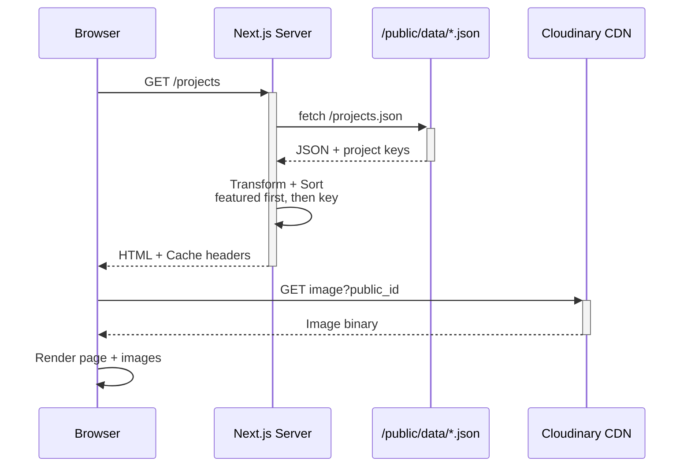
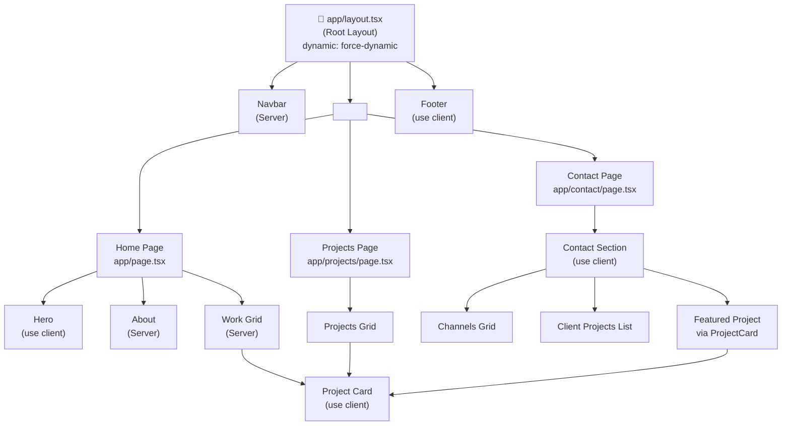
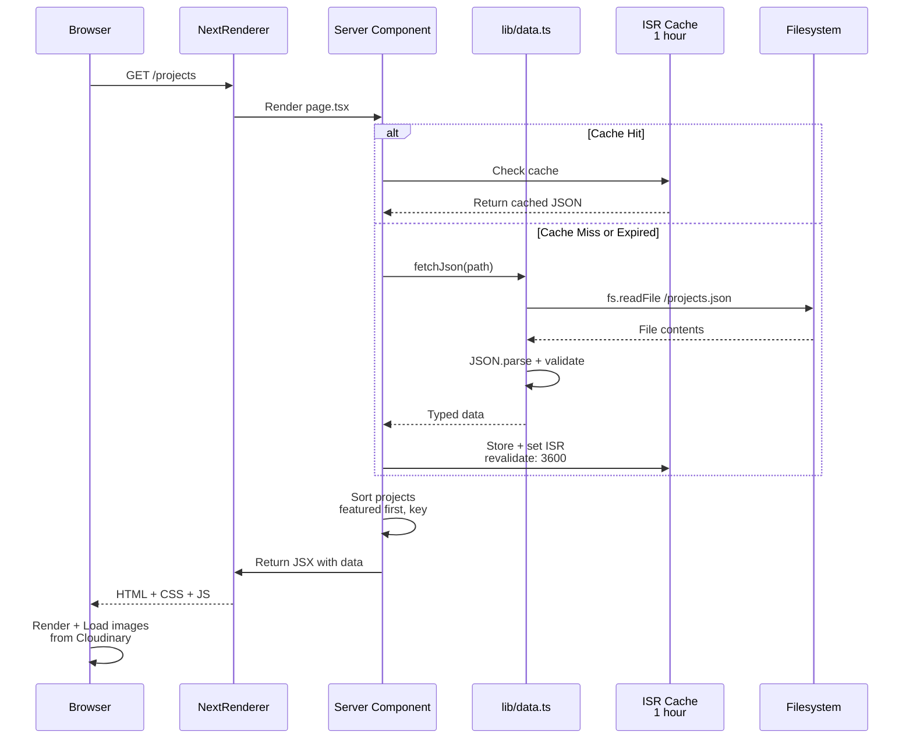
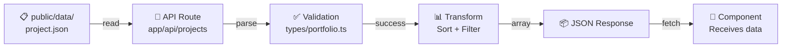
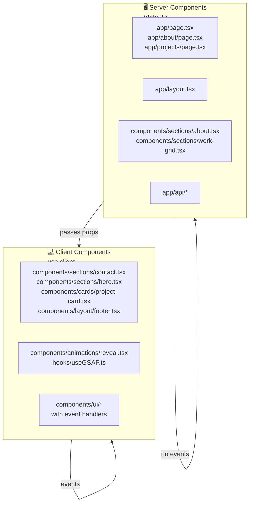

# Architecture

## System Architecture

```mermaid
graph TB
    User["👤 User Browser"]
    NextApp["⚙️ Next.js 16 App<br/>(force-dynamic)"]

    Pages["📄 Page Components<br/>(Server)"]
    Sections["🎨 Section Components<br/>(Client + Server)"]
    Cards["🃏 Card Components<br/>(Client)"]

    APIRoutes["🔌 API Routes"]
    JSONData["📋 JSON Data<br/>/public/data"]

    Cloudinary["☁️ Cloudinary CDN<br/>Images"]

    User -->|HTTP Request| NextApp
    NextApp -->|Route| Pages
    Pages -->|Import| Sections
    Pages -->|Import| APIRoutes
    Sections -->|Render| Cards
    Pages -->|fetch()| JSONData
    APIRoutes -->|read| JSONData
    Pages -->|Image URLs| Cloudinary
    Cards -->|Image URLs| Cloudinary

    Cloudinary -->|Image Data| User
    NextApp -->|HTML/CSS/JS| User
```

## Data Flow



## Component Hierarchy



## Request-Response Cycle (Example: `/projects`)



## File Processing Pipeline



## Styling Pipeline

```
Tailwind CSS 4
    ↓
PostCSS (postcss.config.mjs)
    ↓
Component Classes
    ↓
CVA (class-variance-authority)
    ↓
clsx + tailwind-merge
    ↓
Final CSS Classes
```

## Client/Server Component Boundaries



## Key Architectural Decisions

### 1. Server-First Data Fetching

- **Why**: Single source of truth, no client-side race conditions
- **How**: `lib/data.ts` with ISR caching (1 hour revalidation)
- **Result**: Data consistency across all pages

### 2. Centralized Type Definitions

- **Why**: Single TypeScript interface for all data structures
- **How**: All types in `types/portfolio.ts`
- **Result**: Compile-time safety; catch schema changes immediately

### 3. JSON-Driven Content

- **Why**: Enables non-developer content updates without code changes
- **How**: JSON files in `/public/data/`, loaded at build/ISR time
- **Result**: Separates content from presentation

### 4. Icon Mapping Layer

- **Why**: Decouples icon names from component imports
- **How**: Centralized `lib/iconMapper.ts` with static Record
- **Result**: Can swap icon libraries with one file change

### 5. Lazy Animation Setup

- **Why**: Animations shouldn't block initial page render
- **How**: GSAP ScrollTrigger created on scroll events via `useGSAP`
- **Result**: Fast First Contentful Paint (FCP)

### 6. Force-Dynamic Root Layout

- **Why**: Portfolio content changes; static generation not appropriate
- **How**: `dynamic: "force-dynamic"` in app/layout.tsx
- **Result**: Always fresh content without manual ISR purge

## Performance Considerations

### Image Loading

- Cloudinary CDN handles resizing and caching
- Unoptimized Image component (no Next.js optimization layer)
- Reason: Cloudinary already URL-based; double optimization unnecessary

### Data Fetching

- Cached via ISR for 1 hour
- API routes reuse JSON file reads
- Parallel fetching in components where appropriate

### Bundling

- React Compiler (babel-plugin-react-compiler) auto-memos components
- Tree-shaking enabled for unused react-icons
- CSS pruning via Tailwind JIT mode

## Build System

```
Development:  npm run dev        → Next.js dev server with HMR
Build:        npm run build      → next build --webpack
Production:   next start         → Node.js HTTP server
```

**Note**: `--webpack` flag required for PWA support; do not remove from build scripts.
