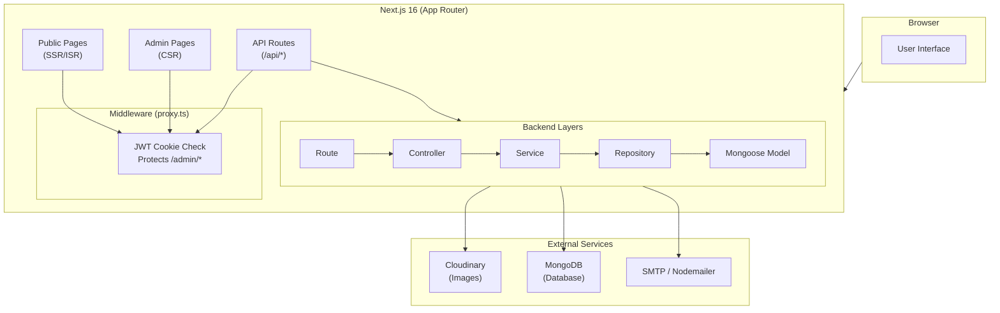
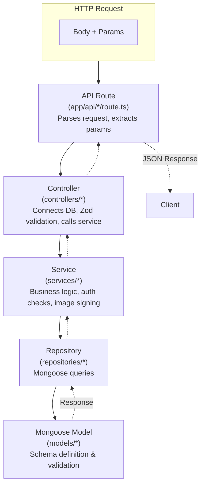
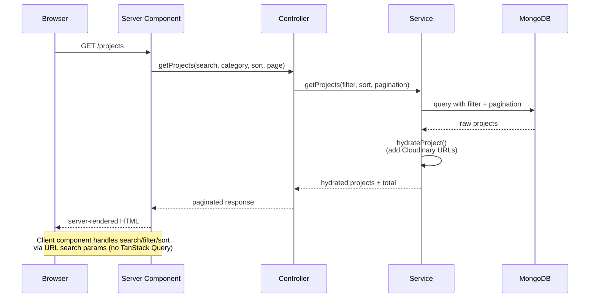
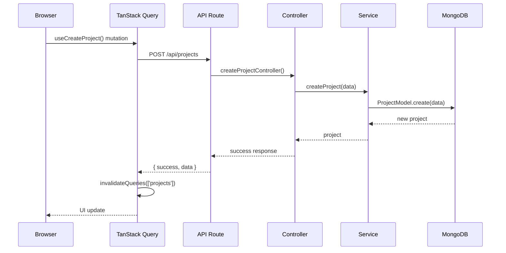
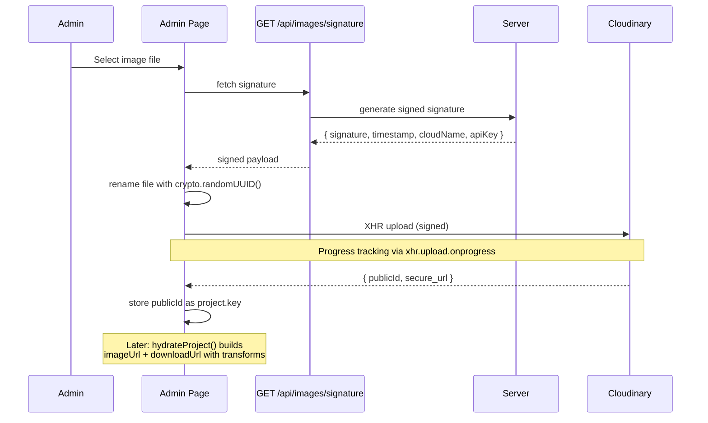

# Architecture — High-Level Design

> **Portfolio Neeta** — Full-stack portfolio site with admin CMS.

## System Overview



## Tech Stack

| Layer | Technology | Purpose |
|-------|-----------|---------|
| **Framework** | Next.js 16 (App Router) | Full-stack React framework |
| **UI Library** | React 19, shadcn/ui (Radix) | Component primitives |
| **Styling** | Tailwind CSS v4, CSS variables | Utility-first + design tokens |
| **Database** | MongoDB + Mongoose 8 | Document store |
| **Auth** | JWT (jsonwebtoken + jose), bcryptjs | Stateless auth |
| **Client State** | TanStack React Query 5 | Server state cache |
| **Validation** | Zod 3 | Schema validation |
| **Image CDN** | Cloudinary | Upload + transform + delivery |
| **Animations** | GSAP 3.15 + ScrollTrigger | Scroll reveals, hover fx |
| **Email** | Nodemailer | SMTP notifications |
| **Analytics** | Vercel Analytics | Usage tracking |
| **Theme** | next-themes | Dark/light mode |
| **Icons** | react-icons, radix-icons | Icon components |
| **Lint** | ESLint 9 (flat config) | Code quality |

## Layered Backend Pattern

Every API route follows the same pipeline:



### Why This Pattern

- **Separation of concerns** — Each layer has a single responsibility
- **Testability** — Services and repositories can be tested independently
- **Consistency** — Every endpoint follows the same structure
- **Thin routes** — Routes only parse requests, never contain business logic

## Rendering Strategy

| Page Type | Rendering | Data Source |
|-----------|-----------|-------------|
| Home (`/`) | Server | `public/site.json` (cached) |
| Projects (`/projects`) | Server | MongoDB via controller |
| Project Detail (`/projects/[id]`) | Server | MongoDB via controller |
| Contact (`/contact`) | Server | `public/site.json` (cached) |
| Request Logo (`/request/logo`) | Server (form is client) | Zod validation |
| Request Status (`/request/[id]`) | Server | MongoDB via controller |
| Admin Dashboard (`/admin`) | Server (via client query) | TanStack Query → API |
| Admin Login (`/admin/login`) | Client | TanStack Query → API |
| Admin Requests (`/admin/requests`) | Server (via client query) | TanStack Query → API |

## Data Flow Diagrams

### Public Pages (e.g., Projects Listing)



### Admin CRUD (e.g., Create Project)



### Image Upload Flow



## Caching Strategy

| Cache Layer | Mechanism | Duration |
|-------------|-----------|----------|
| `site.json` | React `cache()` + ISR | `revalidate = 3600` (1 hour) |
| TanStack Query | Memory cache | `staleTime: 5 * 60 * 1000` (5 min) |
| Cloudinary images | CDN edge cache | Cloudinary-managed |
| Next.js pages | ISR (Incremental Static Regeneration) | Per-route revalidate |

## Directory Layout (Key)

```
app/            Next.js App Router (pages + API routes)
components/     React components (layout, sections, cards, forms, ui)
controllers/    Request handling orchestration
services/       Business logic layer
repositories/   Data access layer (Mongoose queries)
models/         Mongoose schema definitions
hooks/          Custom React hooks (TanStack, GSAP, form persistence)
lib/            Utilities, helpers, config accessors, email, Cloudinary
types/          TypeScript type definitions
styles/         Global CSS with Tailwind v4 theme variables
scripts/        Utility scripts (seed, CLI helpers)
public/         Static assets + site.json content config
```
