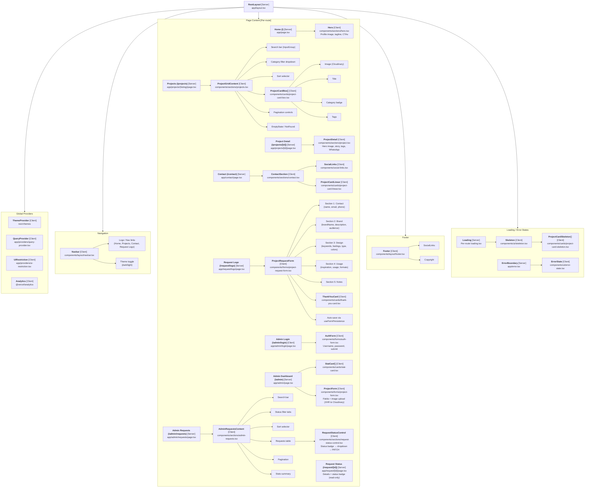

# Component Tree Reference

## Rendering Strategy

- **Server Components (default)** — No `"use client"` directive. Fetch data, render HTML.
- **Client Components** — Explicitly marked `"use client"`. Use hooks, browser APIs, state, event handlers.

## Component Tree



## shadcn/ui Primitives (`components/ui/*`)

All located in `components/ui/`:

| Component | File | Lines | Notes |
|-----------|------|-------|-------|
| Badge | `badge.tsx` | 35 | Variants: default, secondary, outline, destructive |
| Button | `button.tsx` | 67 | Variants: default, secondary, outline, ghost, link, destructive |
| ButtonGroup | `button-group.tsx` | 40 | Horizontal button grouping |
| Card | `card.tsx` | 112 | Card, CardHeader, CardTitle, CardDescription, CardContent, CardFooter |
| Checkbox | `checkbox.tsx` | 15 | Radix checkbox |
| DropdownMenu | `dropdown-menu.tsx` | 235 | Full Radix dropdown with trigger, content, items, separators |
| ErrorState | `error-state.tsx` | 64 | Empty, not-found, error variants |
| Input | `input.tsx` | 15 | Styled input |
| InputGroup | `input-group.tsx` | 145 | Search input with icon, clear, suggestions |
| Label | `label.tsx` | 10 | Radix label |
| Separator | `separator.tsx` | 10 | Horizontal rule |
| Skeleton | `skeleton.tsx` | 64 | Loading skeleton |
| Textarea | `textarea.tsx` | 10 | Styled textarea |

## Cards (`components/cards/*`)

| Component | File | Lines | Usage |
|-----------|------|-------|-------|
| `ProjectCardBox` | `project-card-box.tsx` | 71 | Grid project card (projects listing) |
| `ProjectCardLinear` | `project-card-linear.tsx` | 76 | Horizontal card (contact page) |
| `ProjectCardSkeleton` | `project-card-skeleton.tsx` | 57 | Loading placeholder for cards |
| `StatCard` | `stat-card.tsx` | 35 | Dashboard statistic display |
| `ThankYouCard` | `thank-you-card.tsx` | 42 | Success state after form submit |

## Custom Hooks

| Hook | File | Purpose |
|------|------|---------|
| `useApi.ts` | 137 lines | All TanStack Query mutations/queries + `apiRequest` fetch wrapper |
| `useGSAP.ts` | 90 lines | GSAP + ScrollTrigger initialization and cleanup |
| `useFormPersistence.ts` | 34 lines | localStorage form save/restore (debounced 500ms) |

## Animation System

Components use data attributes consumed by `useGSAP`:

```html
<div data-reveal>           <!-- Scroll-triggered fade-in + slide-up -->
<div data-hover-lift>       <!-- Hover: translateY(-4px) shadow lift -->
```

GSAP is initialized with ScrollTrigger plugin. All animations are cleaned up on unmount via GSAP's `ScrollTrigger.refresh()` and `context.revert()`.
