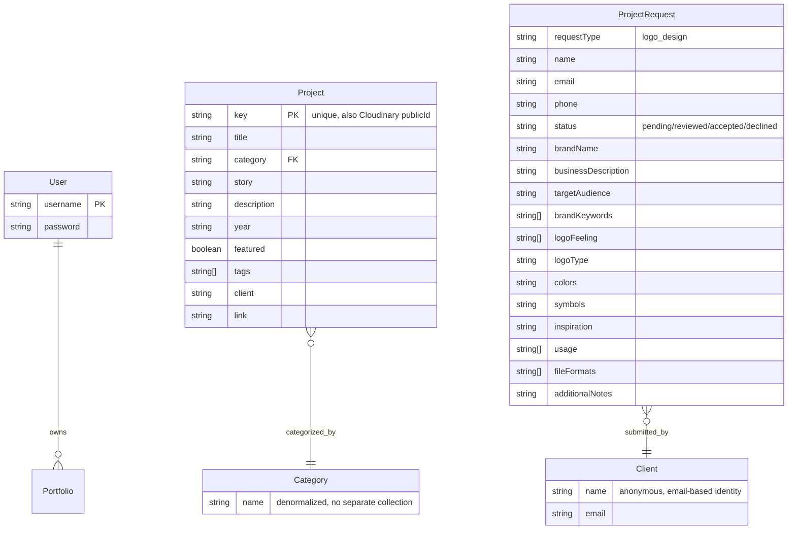

# Database Schema Design

## Overview

- **Database:** MongoDB
- **ODM:** Mongoose 8
- **Connection:** Singleton pattern with global cached connection (`lib/db.ts`)
- **Replica Set:** Required for transactions (not currently used, all operations are single-document)

## Connection (`lib/db.ts`)

```typescript
let cached = global._mongoose;

if (!cached) {
  cached = global._mongoose = { conn: null, promise: null };
}

async function connectToDatabase() {
  if (cached.conn) return cached.conn;
  cached.promise = mongoose.connect(MONGODB_URI, { bufferCommands: false });
  cached.conn = await cached.promise;
  return cached.conn;
}
```

- Called at the controller level before any database operation
- Handles connection errors gracefully with `AppError`

---

## Model: User

**File:** `models/user.ts`
**Collection:** `users`

| Field | Type | Required | Unique | Indexed | Default | Notes |
|-------|------|----------|--------|---------|---------|-------|
| `username` | String | Yes | Yes | Yes | — | Admin login username |
| `password` | String | Yes | No | No | — | bcrypt hash, `select: false` |
| `createdAt` | Date | auto | — | — | — | Mongoose timestamps |
| `updatedAt` | Date | auto | — | — | — | Mongoose timestamps |

### Notes
- Password is excluded from query results by default (`select: false`)
- Only one user expected (admin), multiple signup disabled via `DISABLE_ONBOARDING`

---

## Model: Project

**File:** `models/project.ts`
**Collection:** `projects`

| Field | Type | Required | Unique | Indexed | Default | Notes |
|-------|------|----------|--------|---------|---------|-------|
| `key` | String | Yes | Yes | Yes | — | URL-safe slug, also used as Cloudinary reference |
| `title` | String | Yes | No | No | — | Project display title |
| `category` | String | No | No | Yes | — | Used for filtering |
| `story` | String | No | No | No | — | Long-form project narrative |
| `description` | String | No | No | No | — | Short description |
| `year` | String | No | No | No | Current year | Project completion year |
| `featured` | Boolean | No | No | No | `false` | Featured project flag |
| `tags` | [String] | No | No | No | `[]` | Categorization tags |
| `client` | String | No | No | No | — | Client name |
| `link` | String | No | No | No | — | External project link |
| `createdAt` | Date | auto | — | — | — | Mongoose timestamps |
| `updatedAt` | Date | auto | — | — | — | Mongoose timestamps |

### Indexes
- `key`: Unique index (used for lookups and deduplication)
- `category`: Non-unique index (used for filter queries)

### Queries
- Text search: `{ title: { $regex: search, $options: "i" } }`
- Category filter: `{ category }`
- Pagination: `.skip(skip).limit(limit)` with separate `countDocuments()`
- Stats: `countDocuments()` + `distinct("category")`

---

## Model: ProjectRequest

**File:** `models/projectRequest.ts`
**Collection:** `projectrequests`

| Field | Type | Required | Unique | Indexed | Default | Notes |
|-------|------|----------|--------|---------|---------|-------|
| `requestType` | String | Yes | No | No | — | Enum: `"logo_design"` |
| `name` | String | Yes | No | Yes | — | Client name |
| `email` | String | Yes | No | Yes | — | Client email |
| `phone` | String | No | No | No | — | Contact number |
| `status` | String | No | No | Yes | `"pending"` | Enum: `pending`, `reviewed`, `accepted`, `declined` |
| `brandName` | String | Yes | No | Yes | — | Business/brand name |
| `businessDescription` | String | No | No | No | — | Business overview |
| `targetAudience` | String | No | No | No | — | Target demographic |
| `brandKeywords` | [String] | No | No | No | — | From `BRAND_KEYWORDS` enum |
| `logoFeeling` | [String] | No | No | No | — | From `LOGO_FEELINGS` enum |
| `logoType` | String | No | No | No | — | From `LOGO_TYPE_VALUES` enum |
| `colors` | String | No | No | No | — | Color preferences |
| `symbols` | String | No | No | No | — | Symbol/icon preferences |
| `inspiration` | String | No | No | No | — | Reference URLs or descriptions |
| `usage` | [String] | No | No | No | — | From `USAGE_OPTIONS` enum |
| `fileFormats` | [String] | No | No | No | — | From `FILE_FORMATS` enum |
| `additionalNotes` | String | No | No | No | — | Extra information |
| `createdAt` | Date | auto | — | — | — | Mongoose timestamps |
| `updatedAt` | Date | auto | — | — | — | Mongoose timestamps |

### Indexes
- `name`, `email`, `brandName`: Non-unique indexes (for text search)
- `status`: Non-unique index (for filter queries)

### Search Query
```typescript
{
  $or: [
    { name: { $regex: search, $options: "i" } },
    { email: { $regex: search, $options: "i" } },
    { brandName: { $regex: search, $options: "i" } }
  ]
}
```

---

## Enum Constants (`lib/constants.ts`)

All enum values are defined as `const` arrays and reused in Zod validators + UI components.

### Request Status
```
pending → reviewed → accepted → [delivery]
pending → reviewed → declined
```

### Logo Type
| Value | Label | Short Label |
|-------|-------|-------------|
| `text_logo` | Text Logo (Wordmark) | Wordmark |
| `icon_logo` | Icon Logo (Symbol) | Icon Logo |
| `combination_logo` | Combination Logo | Combination |
| `mascot_logo` | Mascot Logo | Mascot |
| `abstract_logo` | Abstract Logo | Abstract |

### Brand Keywords
`Modern`, `Minimal`, `Luxury`, `Bold`, `Friendly`, `Creative`, `Professional`, `Premium`, `Futuristic`, `Elegant`, `Playful`, `Traditional`, `Artistic`, `Corporate`

### Logo Feelings
`Trust`, `Energy`, `Luxury`, `Fun`, `Confidence`, `Innovation`, `Calm`, `Creativity`, `Strength`, `Happiness`

### Usage Options
`Instagram`, `Website`, `Packaging`, `Business Card`, `App`, `Print`, `YouTube`, `Merchandise`

### File Formats
`PNG`, `JPG`, `SVG`, `PDF`, `AI File`, `Transparent Background`, `Black & White Version`, `Social Media Kit`

---

## Entity Relationships



### Notes

- There are **no formal foreign keys** between collections. Relationships are implicit.
- The `project.key` field doubles as the Cloudinary `publicId` for the project's primary image.
- Categories are denormalized strings on the Project model (no separate Category collection).

There are no formal foreign keys or references between collections. The `project.key` field doubles as:
- A unique identifier for the project
- The Cloudinary `publicId` for the project's primary image

## Image URL Hydration

Projects do not store full image URLs. The `hydrateProject()` function (`lib/projectAssets.ts`) constructs them at query time:

```typescript
function hydrateProject(project) {
  return {
    ...project.toObject(),
    imageUrl: `https://res.cloudinary.com/${CLOUD_NAME}/image/upload/${project.key}`,
    downloadUrl: `https://res.cloudinary.com/${CLOUD_NAME}/image/upload/${project.key}?watermark`
  };
}
```
