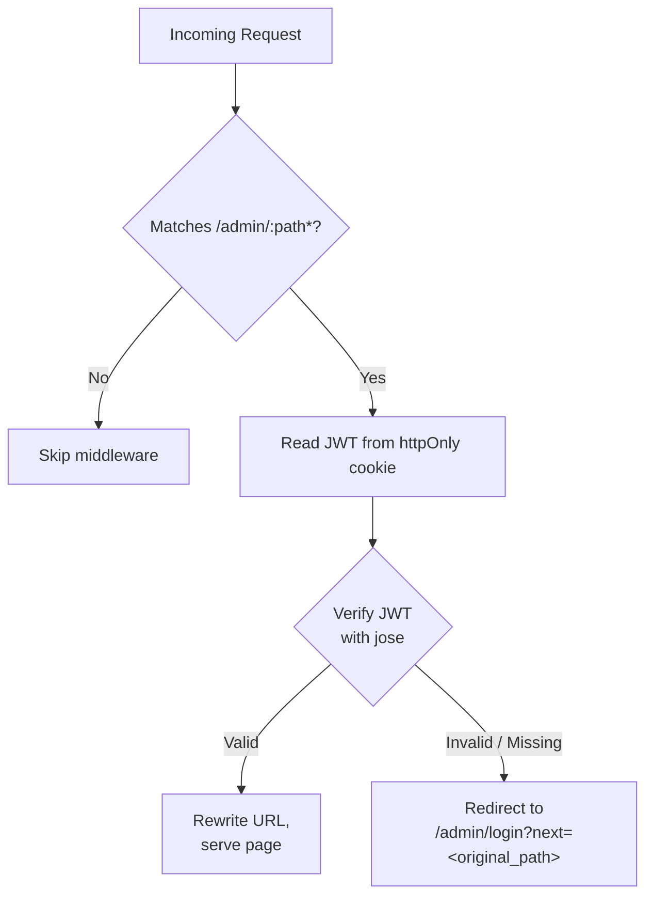

# Low-Level Design — Module Reference

## 1. API Routes (`app/api/*`)

### Auth Routes

#### `POST /api/auth/signup`
- **File:** `app/api/auth/signup/route.ts`
- **Auth:** None (disabled if `DISABLE_ONBOARDING=true`)
- **Controller:** `signupController`
- **Flow:** Validate body → check existing user → hash password → create user → set JWT cookie

#### `POST /api/auth/login`
- **File:** `app/api/auth/login/route.ts`
- **Auth:** None
- **Controller:** `loginController`
- **Flow:** Validate body → find user → compare password → set JWT cookie → return user

#### `POST /api/auth/logout`
- **File:** `app/api/auth/logout/route.ts`
- **Auth:** None
- **Flow:** Clear auth cookie → return success

#### `GET /api/auth/status`
- **File:** `app/api/auth/status/route.ts`
- **Auth:** None
- **Flow:** Check cookie → return `{ authenticated: boolean }`

### Project Routes

#### `GET /api/projects`
- **File:** `app/api/projects/route.ts`
- **Auth:** No
- **Controller:** `getProjectsController`
- **Params:** `search`, `category`, `sort`, `page`, `limit`
- **Flow:** Parse query → call service → hydrate images → return paginated results

#### `POST /api/projects`
- **File:** `app/api/projects/route.ts`
- **Auth:** Yes (JWT required)
- **Controller:** `createProjectController`
- **Flow:** Validate body → check duplicate key → create project → return project

#### `PATCH /api/projects/[id]`
- **File:** `app/api/projects/[id]/route.ts`
- **Auth:** Yes
- **Controller:** `updateProjectController`
- **Flow:** Validate body → find project → update fields → return updated project

### Image Routes

#### `GET /api/images`
- **File:** `app/api/images/route.ts`
- **Auth:** No
- **Flow:** Parse query (`publicId`, `width`, `height`, `crop`, `quality`, `format`, `download`) → construct Cloudinary URL → redirect with transforms
- **Watermark:** When `download=true`, adds "Neeta Bhusal" text watermark overlay

#### `GET /api/images/signature`
- **File:** `app/api/images/signature/route.ts`
- **Auth:** Yes
- **Flow:** Generate timestamp → sign with Cloudinary API secret → return signature + timestamp

### Request Routes

#### `GET /api/requests`
- **File:** `app/api/requests/route.ts`
- **Auth:** Yes (GET)
- **Controller:** `getRequestsController`
- **Params:** `search`, `status`, `sort`, `page`, `limit`

#### `POST /api/requests`
- **File:** `app/api/requests/route.ts`
- **Auth:** No
- **Controller:** `createRequestController`
- **Flow:** Validate body → create request → send email notifications (admin alert + client confirmation)

#### `PATCH /api/requests/[id]`
- **File:** `app/api/requests/[id]/route.ts`
- **Auth:** Yes
- **Controller:** `updateRequestController`
- **Flow:** Validate status → update request → send status email to client

---

## 2. Controllers (`controllers/*`)

### `controllers/auth.ts`
| Function | Route | Responsibility |
|----------|-------|----------------|
| `signupController` | POST /api/auth/signup | Connect DB, check dupe, hash password, create user, set cookie |
| `loginController` | POST /api/auth/login | Connect DB, verify credentials, set cookie |

### `controllers/projects.ts`
| Function | Route | Responsibility |
|----------|-------|----------------|
| `getProjectsController` | GET /api/projects | Parse query params, build filter, paginate, hydrate images |
| `createProjectController` | POST /api/projects | Connect DB, check duplicate key, create project |
| `updateProjectController` | PATCH /api/projects/[id] | Connect DB, update project, return updated doc |
| `getStatsController` | GET /api/admin/stats | Count projects and requests, return dashboard data |

### `controllers/projectRequests.ts`
| Function | Route | Responsibility |
|----------|-------|----------------|
| `getRequestsController` | GET /api/requests | Parse search/status/sort/page, paginate |
| `createRequestController` | POST /api/requests | Validate body, create request, send emails |
| `updateRequestController` | PATCH /api/requests/[id] | Update status, send email notification |

---

## 3. Services (`services/*`)

### `services/auth.ts`
- `registerUser(username, password)` — Hash password, create user, generate JWT
- `loginUser(username, password)` — Find user (with password), compare, generate JWT
- `generateToken(payload)` — Sign JWT with `JWT_SECRET`, 30-day expiry
- `setAuthCookie(response, token)` — Set httpOnly cookie with configurable name/age

### `services/projects.ts`
- `createProject(data)` — Mongoose `create()`
- `updateProject(id, data)` — Mongoose `findByIdAndUpdate()`
- `getProjects(filter, sort, pagination)` — Text search on title, category filter, pagination with total count
- `getStats()` — Count total projects, unique categories

### `services/projectRequests.ts`
- `createRequest(data)` — Mongoose `create()`, trigger email
- `updateRequest(id, data)` — Mongoose `findByIdAndUpdate()`
- `getRequests(filter, sort, pagination)` — Search on name/email/brandName, status filter, pagination

### `services/image.ts`
- `createUploadSignature()` — Generate Cloudinary upload signature with SHA-1

---

## 4. Repositories (`repositories/*`)

### `repositories/project.ts`
- `getAllProjects(filter, sort, skip, limit)` — Returns `{ projects, total }`
- `createProject(data)` — Create single project
- `updateProject(id, data)` — Find by ID and update
- `getProjectById(id)` — Find by ID
- `getProjectByKey(key)` — Find by unique key
- `getStats()` — Aggregate counts

### `repositories/projectRequest.ts`
- `getAllRequests(filter, sort, skip, limit)` — Returns `{ requests, total }`
- `getRequestById(id)` — Find by ID
- `createRequest(data)` — Create single request
- `updateRequest(id, data)` — Find by ID and update
- `getRequestCount()` — Total count

### `repositories/user.ts`
- `createUser(username, hashedPassword)` — Create user
- `findUserByUsername(username)` — Find by username (includes password field)

---

## 5. Models (`models/*`)

### `models/project.ts`
```typescript
{
  key:           String (required, unique, indexed)
  title:         String (required)
  category:      String (indexed)
  story:         String
  description:   String
  year:          String (default: current year)
  featured:      Boolean (default: false)
  tags:          [String] (default: [])
  client:        String
  link:          String
  timestamps:    true (auto createdAt, updatedAt)
}
```

### `models/projectRequest.ts`
```typescript
{
  requestType:        String (enum: "logo_design", required)
  name:               String (required)
  email:              String (required)
  phone:              String
  status:             String (enum: pending/reviewed/accepted/declined, default: "pending")
  brandName:          String (required)
  businessDescription: String
  targetAudience:     String
  brandKeywords:      [String] (enum from BRAND_KEYWORDS)
  logoFeeling:        [String] (enum from LOGO_FEELINGS)
  logoType:           String (enum from LOGO_TYPE_VALUES)
  colors:             String
  symbols:            String
  inspiration:        String
  usage:              [String] (enum from USAGE_OPTIONS)
  fileFormats:        [String] (enum from FILE_FORMATS)
  additionalNotes:    String
  timestamps:         true
}
```

### `models/user.ts`
```typescript
{
  username:   String (required, unique)
  password:   String (required, select: false)
  timestamps: true
}
```

---

## 6. Hooks (`hooks/*`)

### `hooks/useApi.ts`
- `useIsAuthenticated()` — Query for `GET /api/auth/status`
- `useLogin()` — Mutation for `POST /api/auth/login`
- `useLogout()` — Mutation for `POST /api/auth/logout`
- `useSignup()` — Mutation for `POST /api/auth/signup`
- `useCreateProject()` — Mutation for `POST /api/projects`
- `useUpdateProject()` — Mutation for `PATCH /api/projects/[id]`
- `useGetSignature()` — Query for `GET /api/images/signature`
- `useGetRequests()` — Query for `GET /api/requests`
- `useUpdateRequest()` — Mutation for `PATCH /api/requests/[id]`
- `useCreateRequest()` — Mutation for `POST /api/requests`
- `apiRequest()` — Base typed fetch wrapper with credentials

### `hooks/useGSAP.ts`
- Initializes GSAP + ScrollTrigger
- `[data-reveal]` — Scroll-triggered fade-in/up animation
- `[data-hover-lift]` — Hover lift effect
- Cleans up on unmount

### `hooks/useFormPersistence.ts`
- Saves form data to `localStorage` (debounced 500ms)
- Restores saved data on mount
- Clears on successful submit

---

## 7. Lib Utilities (`lib/*`)

| File | Exports | Purpose |
|------|---------|---------|
| `apiClient.ts` | `apiRequest<T>()` | Typed fetch wrapper with `{ success, data/error }` response handling |
| `apiResponse.ts` | `successResponse()`, `errorResponse()` | Standard Next.js API response helpers |
| `auth.ts` | `getAuthPayload()`, `hashPassword()`, `comparePassword()`, `generateToken()`, `setAuthCookie()`, `clearAuthCookie()`, `isAuthenticated()` | JWT + bcrypt auth utilities |
| `cloudinary.ts` | `uploadImageToCloudinary()` | XHR upload to Cloudinary with progress |
| `constants.ts` | Status, logo type, keyword, feeling, usage, format enums | Reusable option arrays and label maps |
| `data.ts` | `getCachedSiteData()` | React `cache()` wrapper for `public/site.json` |
| `db.ts` | `connectToDatabase()` | Mongoose singleton connection with global cache |
| `email.ts` | `sendRequestSubmissionEmails()`, `sendRequestUpdateEmail()` | Nodemailer email templates |
| `env.ts` | `env` object | Runtime-safe environment variable accessor |
| `errors.ts` | `AppError` class | Custom error class with status code |
| `iconMapper.ts` | `getIcon()` | Maps string names to react-icons components |
| `projectAssets.ts` | `hydrateProject()` | Enriches projects with Cloudinary image URLs |
| `seo.ts` | `buildMetadata()` | Generate Open Graph / Twitter metadata |
| `utils.ts` | `cn()` | `clsx` + `tailwind-merge` utility |
| `validators.ts` | Zod schemas for every input | `loginSchema`, `signupSchema`, `projectSchema`, `requestSchema`, etc. |
| `server-auth.ts` | `getAuthPayload()` | Server-only JWT verification helper |

---

## 8. Types (`types/*`)

| File | Key Types | Purpose |
|------|-----------|---------|
| `portfolio.ts` | `SiteData`, `Project`, `ProjectRequest`, `ProjectsResponse`, `SiteSeo`, `SiteContent`, `ProfileInfo`, `SocialLink`, `ClientProject` | Domain types matching site.json + DB shapes |
| `api.ts` | `ApiResponse<T>`, `ApiRequestOptions` | Generic API response wrapper |
| `auth.ts` | `LoginPayload`, `AuthUser`, `AuthStatus` | Auth-specific types |
| `upload.ts` | `UploadSignaturePayload`, `UploadedAsset` | Cloudinary upload types |
| `index.ts` | `PageProps`, `SearchParams` | Utility types for Next.js pages |

---

## 9. Middleware (`proxy.ts`)



- Uses `jose` for Edge-compatible JWT verification
- Bypasses `/admin/login` and static files
- Configurable via `matcher: ["/admin/:path*"]`
