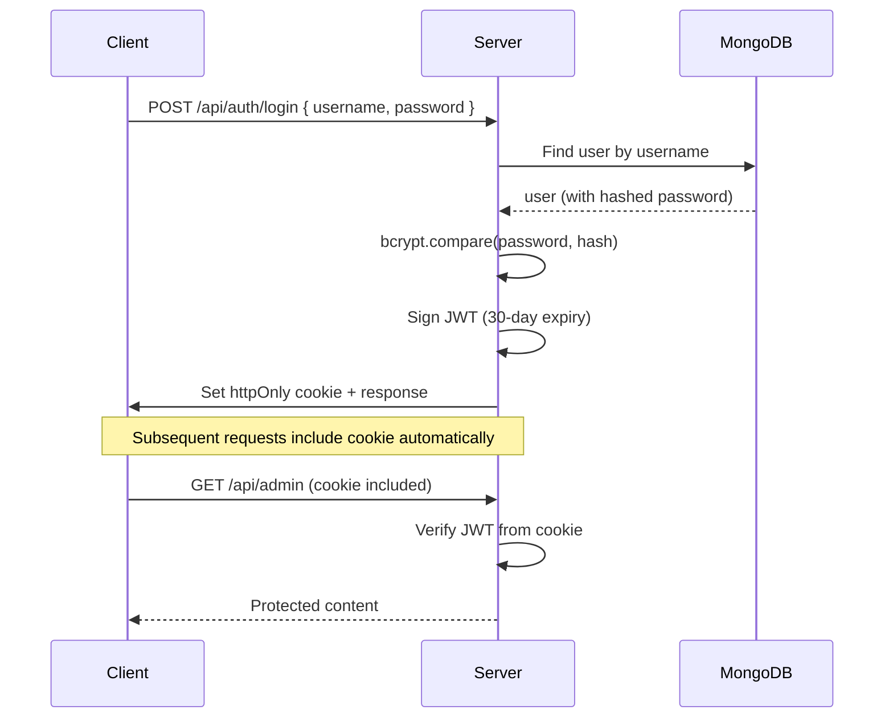
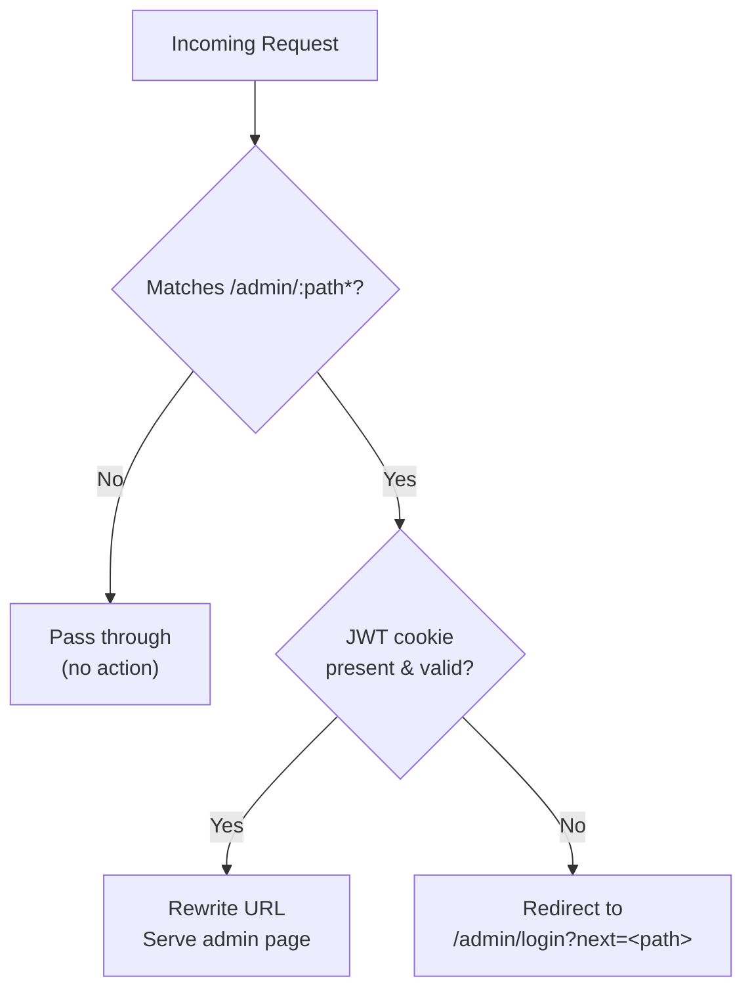
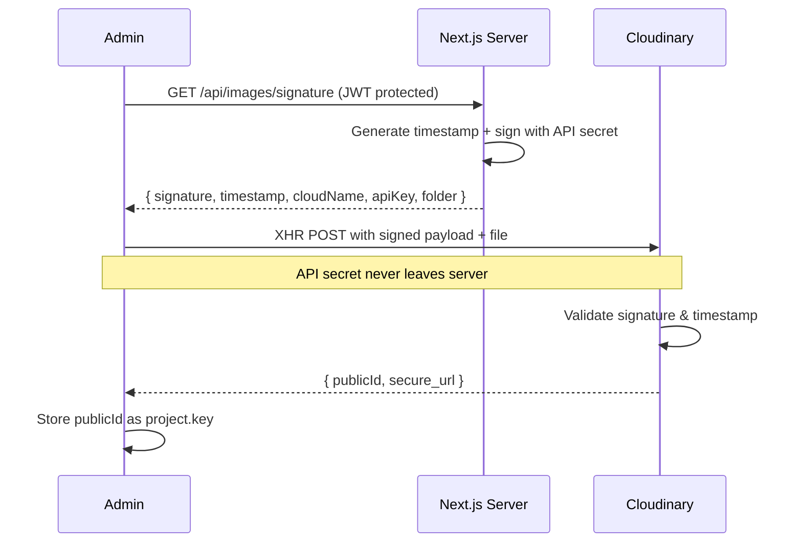

# Security Documentation

## Authentication Architecture

### JWT-Based Auth



### Cookie Configuration
| Property | Value | Rationale |
|----------|-------|-----------|
| `httpOnly` | `true` | Prevents XSS access to token |
| `secure` | `true` (prod) | HTTPS only in production |
| `sameSite` | `lax` | CSRF protection, allows top-level navigation |
| `path` | `/` | Available across all routes |
| `maxAge` | `2592000` (30 days) | Session duration |

### JWT Payload
```typescript
{ "username": "admin", "iat": <issued>, "exp": <expiry> }
```

### Password Security
- **Hashing:** bcryptjs with 10 salt rounds
- **Storage:** `select: false` on password field (never returned in queries)
- **Comparison:** `bcrypt.compare()` — constant-time comparison

## Route Protection

### Middleware (`proxy.ts`)



- Runs at the Edge, before any page renders
- Uses `jose` for JWT verification (Edge-compatible)
- Excludes `/admin/login` from protection
- Excludes static files (`_next/static`, `favicon.ico`)

### API Route Protection
Protected routes (POST/PATCH on projects, images, requests) call `getAuthPayload()`:

```typescript
function getAuthPayload(): { username: string }
// Throws AppError(401) if cookie missing or JWT invalid
```

### Multi-Signup Prevention
- `DISABLE_ONBOARDING=true` disables the `POST /api/auth/signup` route
- After creating the admin account, this should always be enabled

## CSRF Protection

- **SameSite cookie:** `lax` prevents CSRF from external sites
- **No cookie-based API access from cross-origin:** CORS not configured (not needed for same-origin)

## XSS Prevention

| Measure | Implementation |
|---------|---------------|
| httpOnly cookies | Auth token never accessible via `document.cookie` |
| React's built-in escaping | All user content rendered via JSX (auto-escaped) |
| No `dangerouslySetInnerHTML` | Not used anywhere in codebase |
| Input validation | Zod schemas validate all user input |

## Image Security

### Upload Flow



- Upload signature is time-bound (timestamp-based)
- API secret never leaves the server
- Signature generated server-side only
- Upload endpoint is authenticated (requires JWT)

### Delivery
- Images served via Cloudinary CDN
- Watermark applied server-side when `download` parameter is set
- No direct file system access

## Input Validation (Zod)

All user input is validated server-side with Zod schemas (`lib/validators.ts`):

| Schema | Inputs | Key Validations |
|--------|--------|-----------------|
| `loginSchema` | username, password | min length checks |
| `projectSchema` | key, title, category, etc. | key format (lowercase + hyphens), required fields |
| `requestSchema` | name, email, brandName, etc. | email format, enum value constraints |
| `requestUpdateSchema` | status | enum membership check |

### Error Handling
- Validation errors return `400` with field-level details
- Duplicate key errors return `409`
- Auth errors return `401`
- Not found returns `404`

## Environment Variable Security

| Threat | Mitigation |
|--------|-----------|
| Secret exposure in code | All secrets via `process.env`, `.env` in `.gitignore` |
| Client-side secret access | `lib/env.ts` only accessible server-side |
| Vercel env var leaks | Encrypted at rest in Vercel dashboard |

## Infrastructure Security

| Layer | Measure |
|-------|---------|
| **Database** | MongoDB Atlas with IP whitelist |
| **Hosting** | Vercel with automatic HTTPS, DDoS protection |
| **CDN** | Cloudinary handles image delivery, DDoS protection |
| **Analytics** | Vercel Analytics (privacy-compliant) |

## Error Handling

- `AppError` class with status code and message (`lib/errors.ts`)
- API responses never leak stack traces or internal details
- Client receives only `{ success: false, error: { message } }`
- Unhandled errors caught by Next.js error boundary

## Security Headers

Vercel automatically applies security headers (HSTS, X-Content-Type-Options, etc.). Custom headers can be added in `next.config.ts` if needed.

## Recommended Production Setup

1. Use strong JWT secret (32+ random bytes)
2. Enable `DISABLE_ONBOARDING=true`
3. Use MongoDB Atlas with IP whitelist
4. Use HTTPS (automatic on Vercel)
5. Keep Cloudinary API secret server-only
6. Regularly rotate JWT_SECRET and SMTP credentials
7. Monitor Vercel analytics for unusual traffic
8. Keep dependencies updated (`npm audit` regularly)
