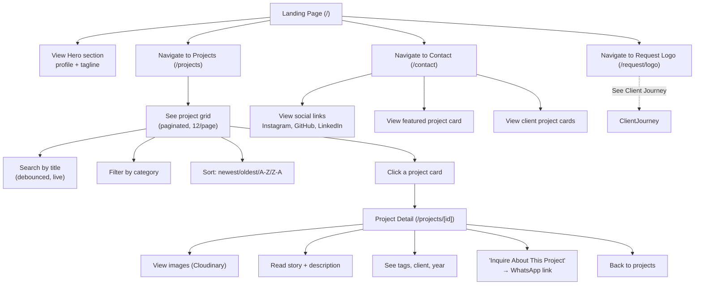
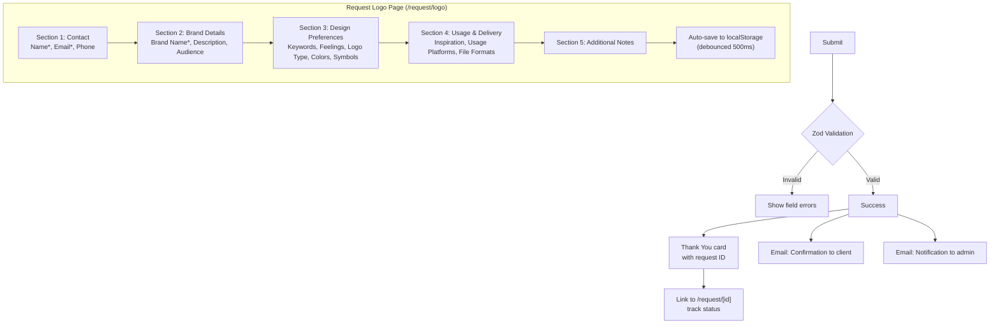
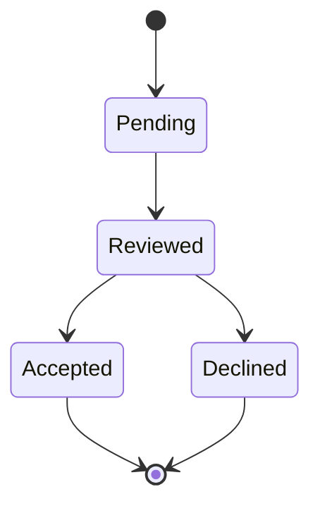
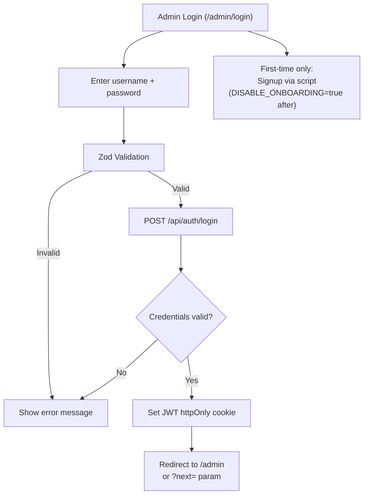
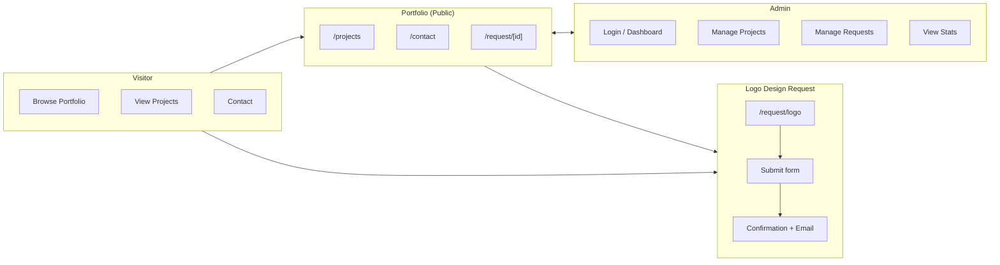

# User Journeys

## 1. Visitor — Browse Portfolio



### Touchpoints
- All pages have sticky navbar with nav links
- Footer with social links and copyright
- GSAP scroll reveals on key sections
- Dark mode (default) / light mode toggle in navbar

---

## 2. Client — Submit Logo Design Request



### Form Persistence
- Draft saved to `localStorage` on every field change (debounced 500ms)
- On remount, saved data restored automatically
- Cleared on successful submission
- Survives page refresh, navigation away, browser close

---

## 3. Client — Track Request Status

```
Request Status Page (/request/[id])
    │
    ├── View request details (read-only)
    │   ├── Brand name, description, preferences
    │   ├── Current status badge
    │   └── All submitted answers displayed
    │
    └── Status updates when admin changes status
            │
            ├── Email notification sent to client
            └── Page reflects new status on refresh
```

### Status Progression



---

## 4. Admin — Authentication



### Session
- JWT cookie: httpOnly, secure (production), sameSite "lax"
- Max age: 30 days (configurable)
- Middleware auto-redirects to login if cookie missing/invalid
- Logout via "Sign Out" button → POST /api/auth/logout

---

## 5. Admin — Dashboard

```
Admin Dashboard (/admin)
    │
    ├── Stats cards: total projects, total requests, pending requests
    │
    ├── Quick actions
    │   └── Link to Manage Requests
    │
    └── Links to admin sections
```

---

## 6. Admin — Manage Projects

```
Admin Projects (no dedicated page — managed via Dashboard)
    │
    ├── Create Project
    │   ├── Fill form: key*, title*, category, story, description, year, tags, client, link
    │   ├── Upload image (drag-and-drop or file picker)
    │   │       │
    │   │       ├── Client-side: fetch signed signature from /api/images/signature
    │   │       ├── Rename file with UUID
    │   │       ├── Upload to Cloudinary via XHR (with progress bar)
    │   │       └── Store returned publicId as project.key
    │   │
    │   └── Submit → POST /api/projects → invalidate projects query cache
    │
    └── Edit Project
        ├── Load existing project data
        ├── Modify fields (same as create)
        ├── Replace image (optional)
        └── Submit → PATCH /api/projects/[id] → invalidate projects query cache
```

---

## 7. Admin — Manage Requests

```
Admin Requests (/admin/requests)
    │
    ├── Requests table with columns: brandName, name, email, status, date, actions
    │
    ├── Search by name, email, or brand name (debounced)
    │
    ├── Filter by status (All, Pending, Reviewed, Accepted, Declined)
    │
    ├── Sort by newest, oldest, brand name A-Z, status A-Z
    │
    ├── Pagination (10 per page)
    │
    └── Status change
            │
            ├── Click status badge → dropdown menu
            ├── Select new status (pending/reviewed/accepted/declined)
            ├── PATCH /api/requests/[id] → invalidate requests query cache
            └── Email sent to client: status update notification
```

---

## Flow Diagram


